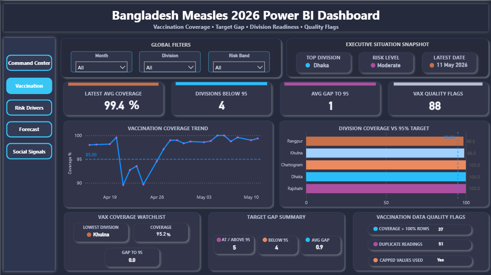
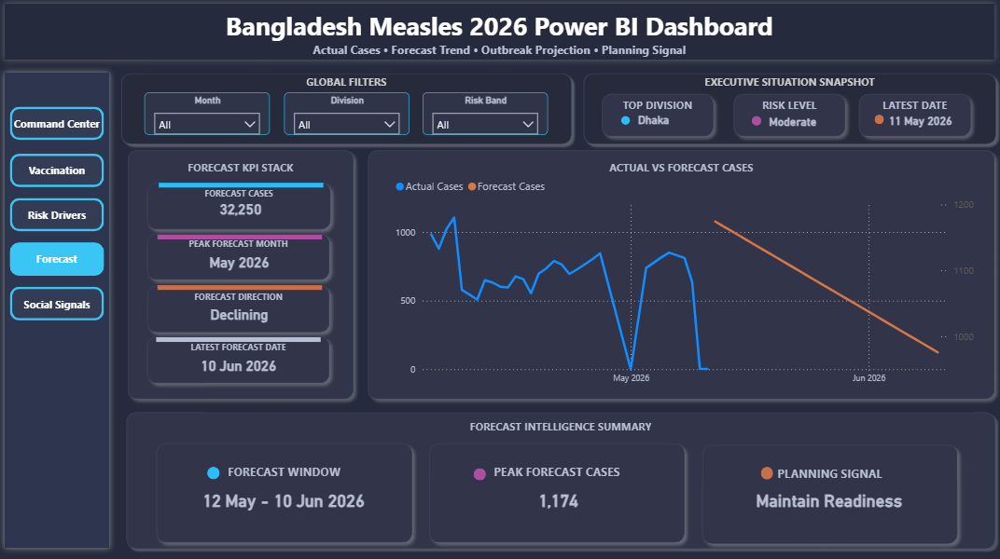

# Bangladesh Measles Surveillance Dashboard

A portfolio-level Power BI dashboard for simulated Bangladesh measles outbreak monitoring, covering cases analysis, vaccination tracking, risk drivers, forecasting, and social signal insights.

## Project Overview

This project presents an executive-level interactive Power BI dashboard designed to monitor a simulated measles outbreak scenario in Bangladesh for 2026. The dashboard uses a star schema data model and includes multiple analytical pages for public health monitoring and decision support.

## Dashboard Pages

- **Command Center**: Executive overview of cases, risk, vaccination coverage, forecast, and social/data readiness.
- **Vaccination Analysis**: Vaccination coverage, target gap, division readiness, and vaccination data quality flags.
- **Risk Drivers**: Risk score analysis, top risk divisions, risk band distribution, gauge indicator, and risk driver matrix.
- **Forecast**: Actual vs forecast cases, forecast direction, peak forecast, and planning signal.
- **Social Signals**: Social comments, public concern level, top discussion categories, and response interpretation.

## Key Features

- Dark premium executive dashboard design
- Star schema data model
- Interactive slicers for Month, Division, and Risk Band
- Advanced KPI cards
- Risk scoring and vaccination gap monitoring
- Actual vs forecast case trend analysis
- Social signal category analysis
- Data readiness and quality flag indicators
- Portfolio-ready UI/UX design

## Tools Used

- Power BI Desktop
- Power Query
- DAX
- CSV datasets
- Star schema data modeling
- GitHub for project documentation

## Data Model

### Dimension Tables
- Dim Date
- Dim Division

### Fact Tables
- Fact Cases
- Fact Vaccination
- Fact Forecast
- Risk Snapshot
- Social Signals

### Supporting Tables
- Data Dictionary
- Data Quality Report
- Source Catalog

## Screenshots

### Command Center

### Vaccination Analysis

### Risk Drivers

### Forecast

### Social Signals

## Project Purpose

This project was created as a Data Analyst / BI Analyst portfolio project to demonstrate dashboard design, data modeling, DAX, analytical storytelling, and public health data visualization skills.

## Note

This is a simulated dataset created for portfolio and educational purposes. It does not represent official public health data.
